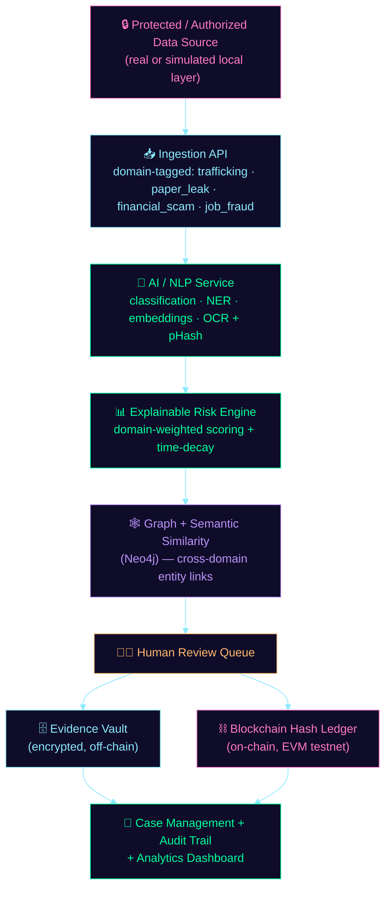
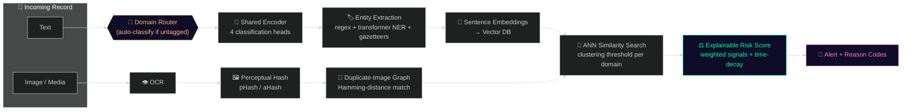
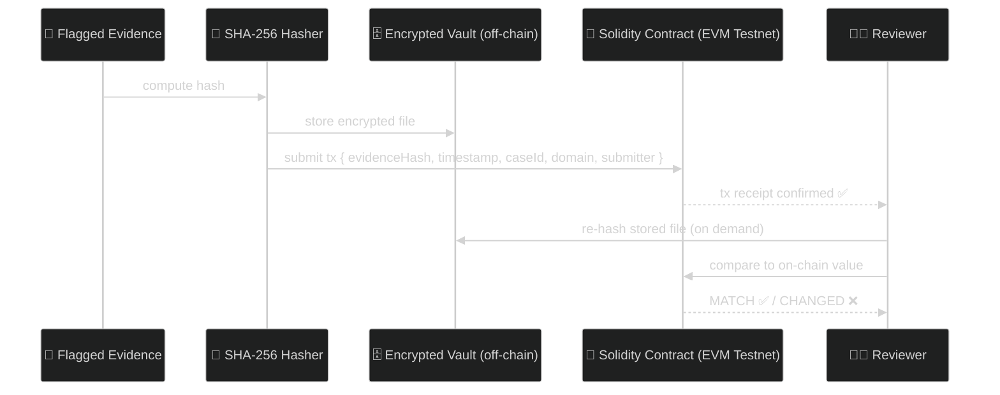
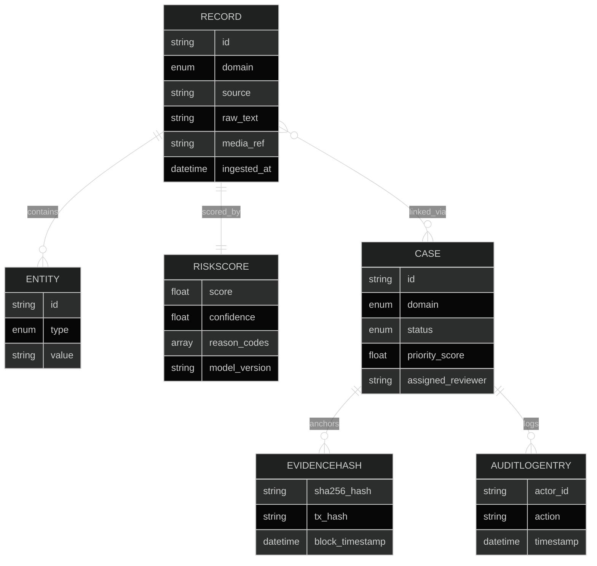
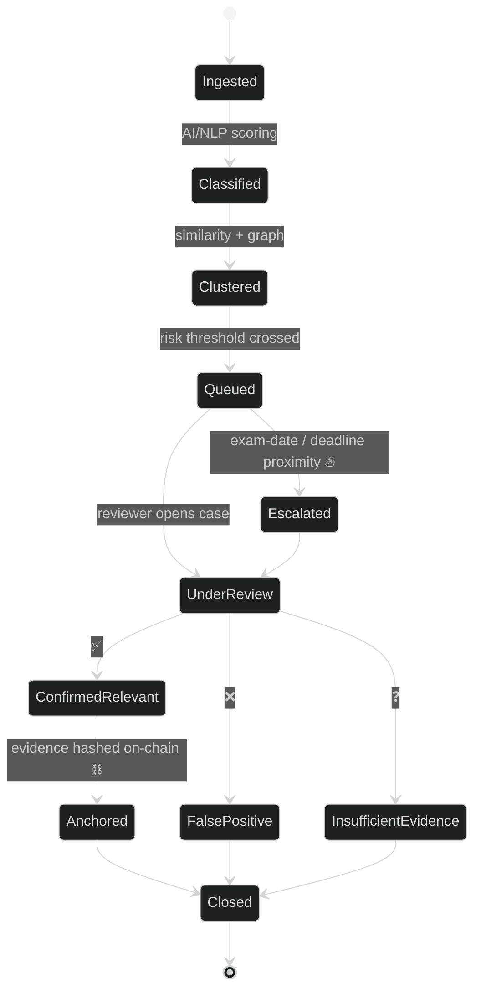

<div align="center">


<br/>


</div>

<br/>

## 🛰️ Transmission Received

> A payment handle surfaces in a "guaranteed 20% monthly returns" group.
> The same handle resurfaces days later — in a fake job offer letter.
> **NarcWare connects the dots before a human even opens the case.**

**NarcWare** is a privacy-preserving intelligence platform that detects, prioritizes, and helps investigate coordinated illicit activity across **four domains** — drug trafficking solicitation, exam paper leaks, financial/investment scams, and job/recruitment fraud — using **one shared architecture**. Swap the classifier, keep the pipeline. That's the whole point.

It ingests only what an operator is legally authorized to see — public channels, user reports, or synthetic data — classifies and clusters it, maps it on a relationship graph, **anchors evidence integrity on-chain**, and routes every high-priority finding through a human before anything happens.

<div align="center">

### 🔐 It Will Never
`break encryption` · `scrape private chats` · `auto-accuse` · `act without a human`

</div>

<br/>

<div align="center">

</div>

## 📡 Table of Contents

| | | | |
|---|---|---|---|
| [🎯 The Four Domains](#-the-four-domains) | [🏗️ Architecture](#️-architecture) | [🧬 Tech Stack](#-tech-stack) | [🧠 AI/ML Pipeline](#-aiml-pipeline) |
| [⛓️ Blockchain Layer](#️-blockchain-evidence-integrity) | [🗂️ Data Model](#️-data-model) | [🔌 API Surface](#-api-surface) | [🔁 Case Lifecycle](#-case-lifecycle) |
| [🛡️ Security & Privacy](#️-security--privacy) | [📊 Success Criteria](#-success-criteria) | [🚀 Getting Started](#-getting-started) | [🗺️ Roadmap](#️-roadmap) |

<br/>

## 🎯 The Four Domains

<table>
<tr>
<td width="25%" align="center">

### 💊
**Trafficking**
<br/>
Coded language, payment links, quantities on public channels

</td>
<td width="25%" align="center">

### 📝
**Paper Leaks**
<br/>
Reposted exam images, urgency tied to exam date

</td>
<td width="25%" align="center">

### 📈
**Financial Scams**
<br/>
"Guaranteed returns," UPI handles, ticking deadlines

</td>
<td width="25%" align="center">

### 💼
**Job Fraud**
<br/>
Fake offer letters, advance-fee requests

</td>
</tr>
</table>

<div align="center">

**⚡ One classifier swap. One reason-code set change. Same pipeline runs all four.**

</div>

<br/>

## 🏗️ Architecture



<br/>

## 🧬 Tech Stack

<div align="center">

| Layer | Stack |
|---|---|
| 🎨 **Frontend** |    |
| ⚙️ **Backend API** |   |
| 🧠 **AI Service** |   |
| 🗃️ **Primary DB** |  |
| 🕸️ **Graph DB** |  |
| 🔍 **Vector DB** |  |
| ⛓️ **Blockchain** |   |
| 🔐 **Auth** |   |
| 📦 **DevOps** |   |

</div>

<br/>

## 🧠 AI/ML Pipeline



**Risk score formula:**

```
score = w1·text_signal + w2·entity_signal + w3·graph_signal + w4·similarity_signal (+ w5·time_decay)
```

> ⚠️ The score **never** ships without its reason codes. The UI visually separates *"AI signal"* from *"human-confirmed fact"* — always.

<br/>

## ⛓️ Blockchain Evidence Integrity



> 🚫 **No raw message content or personal data is ever written on-chain** — only the hash and minimal case metadata.

<br/>

## 🗂️ Data Model



**🕸️ Graph edges (Neo4j):** `MENTIONS` · `LINKED_TO` · `MIRRORS` · `SHARES_PAYMENT_HANDLE` — the last one is what lets a scam and a job-fraud post get linked through a **shared payment handle**, across domains.

<br/>

## 🔌 API Surface

| Method | Endpoint | Purpose |
|---|---|---|
| `POST` | `/api/ingest` | 📥 Submit authorized record, tagged by domain |
| `GET` | `/api/alerts?domain=&status=` | 🚨 Priority-sorted, filterable alert queue |
| `GET` | `/api/cases/{id}` | 📁 Case detail — entities, graph refs, similar cases |
| `POST` | `/api/cases/{id}/review` | ✅ Reviewer submits Confirmed / False-Positive / Insufficient |
| `POST` | `/api/evidence/{id}/hash` | ⛓️ Anchor evidence hash on-chain |
| `GET` | `/api/evidence/{id}/verify` | 🔍 Re-hash and compare to ledger |
| `GET` | `/api/graph/{caseId}` | 🕸️ Relationship graph data |
| `GET` | `/api/analytics/summary?domain=` | 📊 Aggregate dashboard metrics |

<br/>

## 🔁 Case Lifecycle



<br/>

## 🛡️ Security & Privacy

<table>
<tr><td>

**In transit & at rest**
🔒 TLS everywhere · AES-256 at rest for evidence

</td><td>

**Access control**
👤 RBAC at the gateway — `Admin` / `Analyst` / `Read-only`

</td></tr>
<tr><td>

**Audit**
📜 Append-only audit log, every case-affecting action

</td><td>

**Data minimization**
🧊 Only alert ID, score, confidence & reason codes leave the local layer — raw content stays local until human-authorized escalation

</td></tr>
<tr><td>

**Retention**
⏳ Configurable, documented retention window

</td><td>

**Model checks**
📉 False-positive rate + bias/drift checks per domain

</td></tr>
</table>

<div align="center">

### 🚧 Explicitly Out of Scope
`breaking encryption` · `scraping private chats without authorization` · `automated accusation/blocking/law-enforcement action without human review` · `live production platform integration (prototype uses a simulator)`

</div>

<br/>

## 📊 Success Criteria

| Target | Metric |
|---|---|
| 🎯 | **≥80% precision** on synthetic evaluation set, per domain — measured, not assumed |
| 🔗 | **100% hash-verification success** on unaltered test evidence |
| 🖥️ | **Live demo across all four domains** using the identical pipeline, only classifier + reason-codes swapped |
| ⚡ | Alert queue renders in **<3s** at hackathon-scale (~1,000–5,000 records) |

<br/>

## 🚀 Getting Started

```bash
# clone the repo
git clone https://github.com/thestralseer/narc-ware.git
cd narc-ware

# spin up the local stack (frontend, backend, AI service, Postgres, Neo4j)
docker compose up --build

# deploy the evidence-hash contract to Polygon Amoy testnet
cd blockchain && npx hardhat run scripts/deploy.js --network amoy

# feed synthetic messages across all four domains
python simulator/feed.py --domains trafficking,paper_leak,financial_scam,job_fraud
```

> 💡 This is a **hackathon prototype**. The local/on-device detection layer is simulated; no live WhatsApp/Telegram integration ships in this build.

<br/>

## 🗺️ Roadmap

- [x] Shared 4-head classification architecture
- [x] Cross-domain entity linking (`SHARES_PAYMENT_HANDLE`)
- [x] On-chain evidence anchoring + verify flow
- [ ] Multilingual gazetteer expansion (regional slang, state-board exam names)
- [ ] Formal authorization + compliance review path for production deployment
- [ ] Real-time alerting via webhook/notification service

<br/>

<div align="center">

### 🧠 Built on one belief:
**the same architecture that catches a leaked exam paper can catch a fake job offer — because both are just coordinated deception wearing a different mask.**

<br/>


<br/><br/>


</div>
